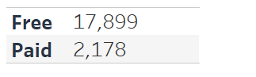
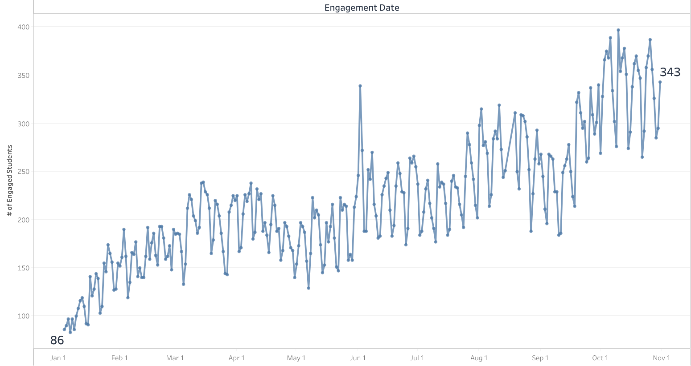
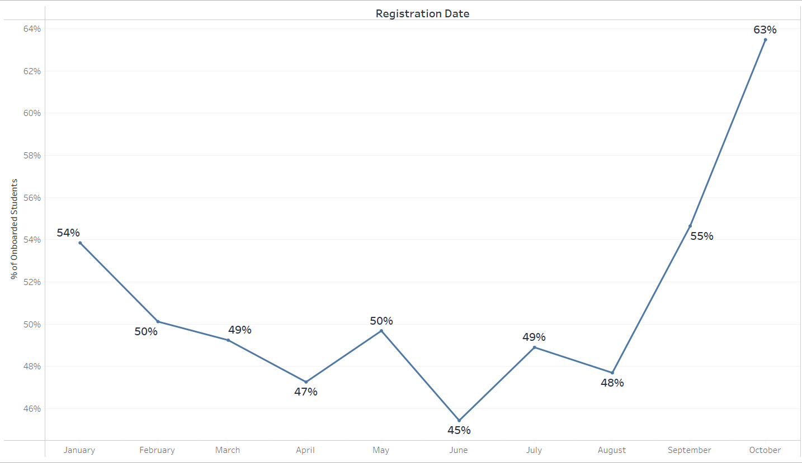
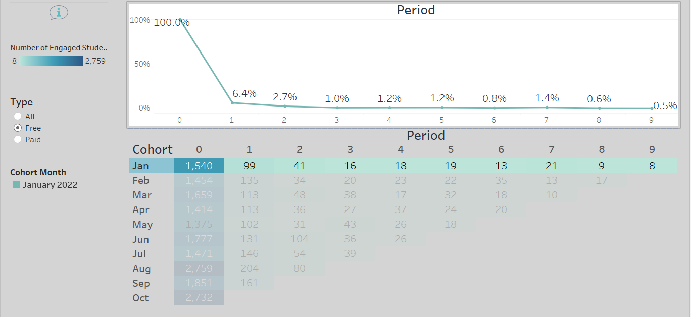
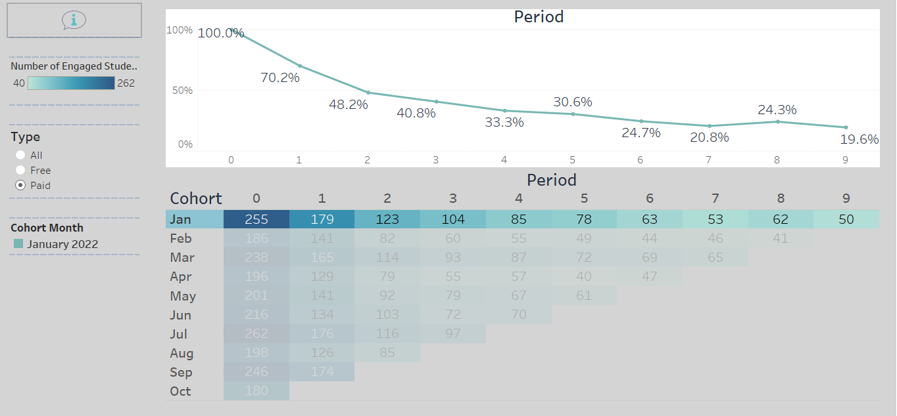
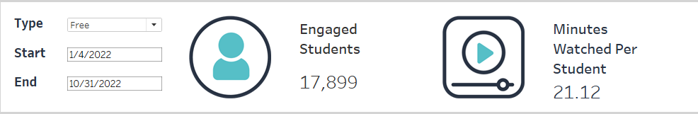
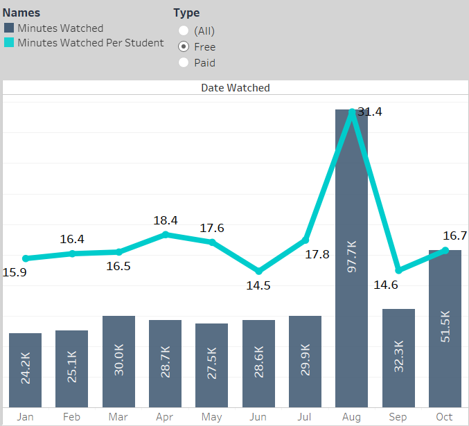
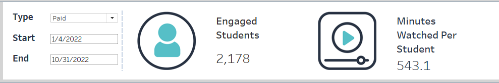
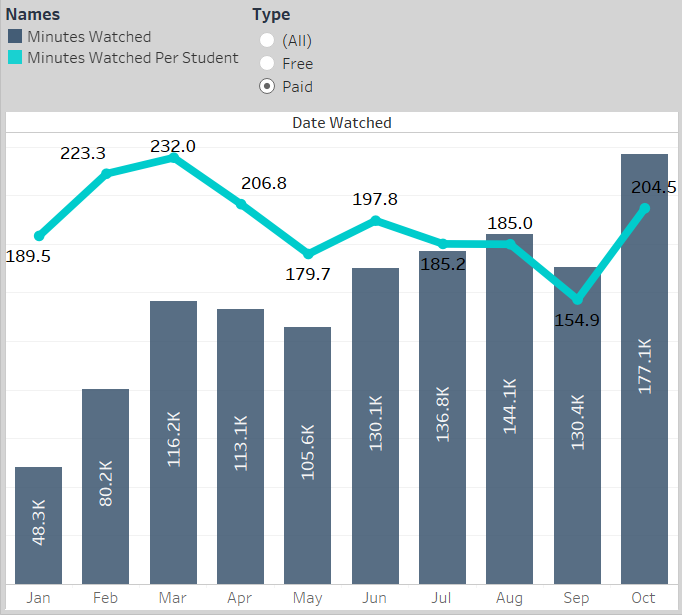

## Here, I'll share some insights from dashboards. It will help to understand how students engage on the platform and discover new areas for improvement.
 
### How engaged are the students inside the platform, and how this differ between free and pay plans? 

**1**
In `Overview Dashboard` `Engaged Students KPI`

    As expected, the number of free plan students is higher than number of students who pay. But some of the free plans converted to paying ones.

    The sum of free and paid plans is more significant than all engaged students shown on the dashboard.
    
    Total Engageing Students = 19,205. Meanwhile, free and paid plans are:

**2**
In `Engagement and Onboarding Dashboard` `First graph`

    The peak occurred in the middle of August because 365 opened the platform free of charge for all students for three days.

    The number of students has tripled compared to the days neighbor of three days.
    
    When excluding these three days to study the graph without abnormal behavior. We can see the trend is the number of engaged students on the platform is increasing.
    
    Engagement has grown from 100 in Jan to 400 by Oct.

 

**3**
In `Engagement and Onboarding Dashboard` `Second graph`

    The percentage of onboarded students compared to registered students is a variance between 40% and 60%.

    When the percentage of onboarded students is above 50% that is a good indicator.
    
    The rating was raised in the middle of September because there is a new gamified virtual of the platform officially launched in the middle of September.

 

### How long do students stay engaged on the platform, and how can this period be extended?

In `Cohort Engagement Dashboard`

    Let's take January  as an example:

    Free Plan Students: 

        As expected, most of the free plan students remain engaged only the month they were onboarded "Registered it" 

    Paid Plan Student:

        The chart looks much different from the free plan student chart. About 70% of students still engage on the platform in the second month

    Hypothesis:

    1. Most of the students are dropped after the first month. They have purchased a monthly plan

    2. On the other, the students who remain engaged. Suppose they have subscribed to a quarterly or annual subscription

    To extend this period, marketing team need to target the right audiance 

    
### Average minutes watched by students? And the difference between free and paid students?

    The average minutes watched by free plan students is between 20 and 30 minutes.

    It indicates the free plan students are interested in the content and completing the unlocked content of the course.

    Some of the free plan students didn't watch any content and others viewed free content in more than one course.  

    Average minutes watched by pay plan students aren't easy to predict because each student has different learning habits.

    Paid plan student roughly complete an average of three courses through their membership.

